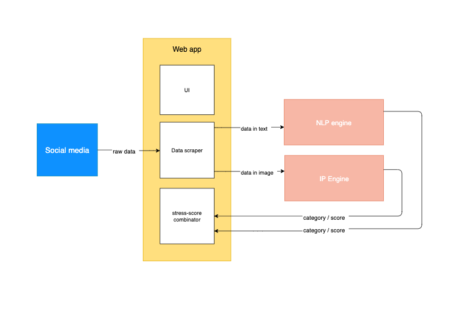
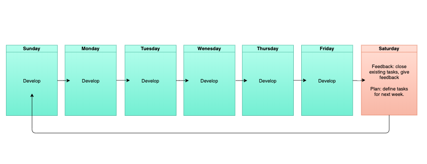

# Stress-detecting-application #
#### Singapore-India Hackathon ####

## 1. Problem identification
###  1.1  What exactly is the problem?
- Stress can leads to depression / hypertension and few cases student may take drastic steps. In essence, stress is not good, and caregivers need a tool to understand psychological and emotional state of students so that they can provide timely support

###  1.2  Why do we need solve this problem?
- Because we believe that helping people is the right thing to do :)

###  1.3  How do we solve this problem?
- Six people team up to develop a technology that enable early detection of stress 

###  1.4  What do we do/What’s our product?
- A website that helps caregivers detect depression / suicidal feelings of students in using social media

## 2. Project planning
### 2.1  What is our goal?
- Before 27/09/2019, finish a website for caregivers, with a dashboard so Caregivers (Teachers, Counsellors & Parents) are alerted and Students can get timely help

### 2.2  How to we define our success?
* We succeed when our app can do the following tasks:
  * Evaluate students' emotional states every 5 minutes
  * Send alert to the caregiver within 15 min when time-critical action is required

### 2.3  What do we use to achieve our goal?

#### 2.3.1 Application architecture

#### 2.3.2 Technologies
##### a. NLP engine
- Language: Python
- Jupyter notebook: to develop model
- ML library: Pytorch / TF
- Pre-trained word vectors: GloVe / Google Vectors
##### b. IP engine
- Language: Python
- Jupyter notebook: to develop model
- ML library: Pytorch / TF
##### c. Web app
- Language: Python / JS
- Framework: Django / Flask
- Tweet Scraping library: TBD

*Facebook chosen for this project as it is the most popular social media

### 2.4 How do we use those tools to achieve our goal?
#### 2.4.1 Team dynamics
- Sunday - Friday: develop
- Saturday: close tasks, give feedback, define new tasks

- **WhatsApp** for chats
- **GitLab** for version control

##### How to add a sub-issue in gitlab?
- In the main dashboard go to **Issues** -> **New Issue**
- Name the sub-issue using the following syntax: [name_of_parent_issue] name_of_sub_issue
- Tip: adding due-date may help you keep track your progress more efficiently.
#### 2.4.2 Implementation plan

##### a. Developers
* NL Engine:
  * Kane
  * Adithya
* IP Engine:
  * Mayur
  * Dhananjay
* Web App:
  * Minal
  * Giang

##### b. Milestones
* [1] Separate components (01/09/019 – 07/09/2019): Develop engines, webapp separately
* [2] Fist version (08/09/019 – 14/09/2019): Integrate engines with webapp
* [3] Second version (15/09/019 – 21/09/2019): Improve performance of application components
* [4] Final Version (22/08/019 – 27/09/2019): Develop additional functionalities

